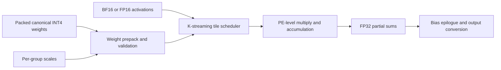

# LPU-oriented architecture notes

This directory documents only the public, high-level mapping between the
canonical INT4 contract and an LPU-style dataflow. It does not contain a real
LPU runtime or enough specification to support bit-accurate or cycle-accurate
claims.

The authoritative Phase G scope and algorithm are documented in
[`../phase-g-lpu-emulation.md`](../phase-g-lpu-emulation.md). The current
`lpu_functional_linear` implementation models:

- K-streaming group traversal;
- activation and weight tiles;
- group-wise scale application;
- FP32 partial-sum accumulation;
- optional bias addition.

It does not model:

- proprietary instruction formats or scheduling;
- physical PE topology, buffer sizes, or memory timing;
- sparse-index encoding and sparse tile layouts;
- FP8 exponent alignment, normalization, rounding, or saturation;
- real latency, throughput, bandwidth, power, or utilization.

Internal reference diagrams are intentionally excluded from the public Git
repository. A future public architecture document should use independently
created English diagrams derived only from publishable interface contracts.

## Public analytical interface boundary

The checkpoint packing, group size, scale layout, zero-point rule, and emulator
output tolerances are frozen for this mapping. A real-LPU backend would still
require its own compiler/runtime contract and device-side validation.
